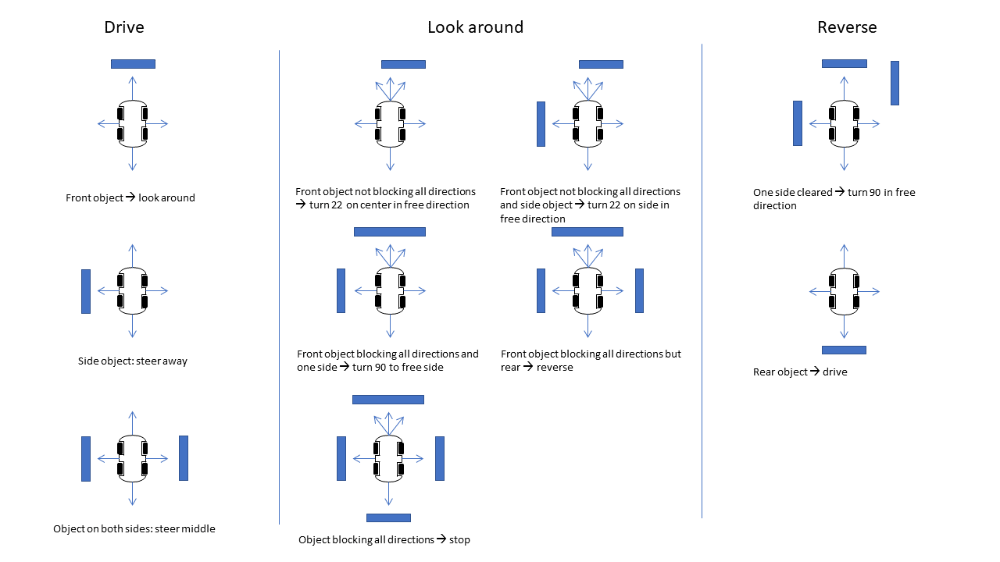

# Robot2

Line following and collision avoidance robot version 2

## Overview

The menu is controlled by the four push buttons. The magnetic sensor needs one time calibration, which is done from the 'Calibrate' menu and choosing 'Magneto cal'. The calibration data is erased by choosing *Reset bounds*. The TCRT5000 sensors can be calibrated by choosing 'Start ir cal' and the data is saved by choosing 'Stop ir cal'. All data is saved to EEPROM. Configurable settings are made from the 'Configuration' menu. The Kp, Ki, Kd and dT parameters used by the motor PID control and the front, side and rear collision distances and the minimal speed are set from this menu. The 'Test drive' menu is used to show the different maneuvers the car can make. The 'Ping' menu option shows the sonar and LIDAR data observed by the car. The collision avoidance mode is selected by choosing 'Self drive' and the line following mode is selected by choosing 'Line Follow'.

## Hardware

* ATmega32 @ 16 MHz
* SG90 Servo
* L293D Motor Driver
* ILI9341 TFT LCD Driver
* QMC5883L Magnetic Sensor
* ITR9608 Optical Interrupters
* HC-SR04 Ultrasonic Ranging Modules
* TCRT5000 Reflective Optical Sensors
* VL53L0X Time-of-Flight Ranging Sensors

## Schematic

## Prototype

## Algorithm

## Firmware
The firmware has been developed in Atmel Studio 7 using GCC C and can be uploaded to the ATmega32 using the ISP connector and an ISP programmer such as [USBasp tool](http://www.fischl.de/usbasp/) using [avrdude](http://www.nongnu.org/avrdude/):

`avrdude -p m32 -c usbasp -U flash:w:Robot2.hex:i -U eeprom:w:Robot2.eep:i -U hfuse:w:0xC9:m -U lfuse:w:0xFF:m`
